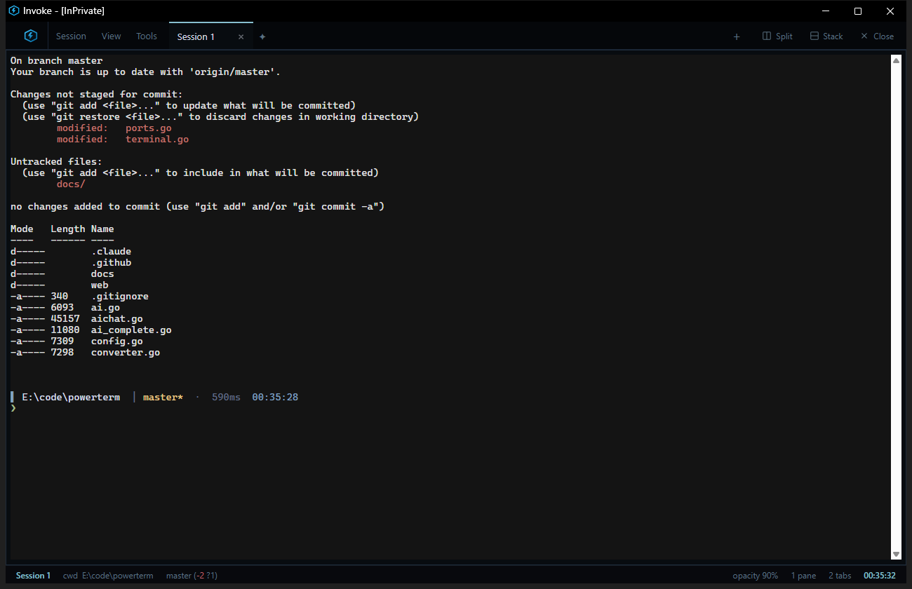
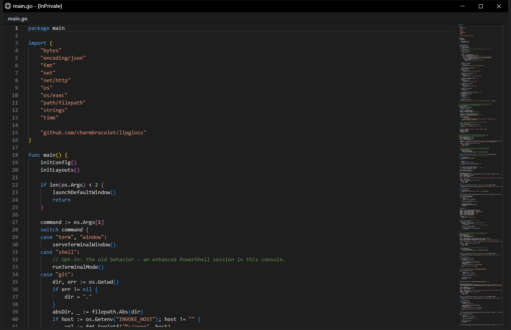
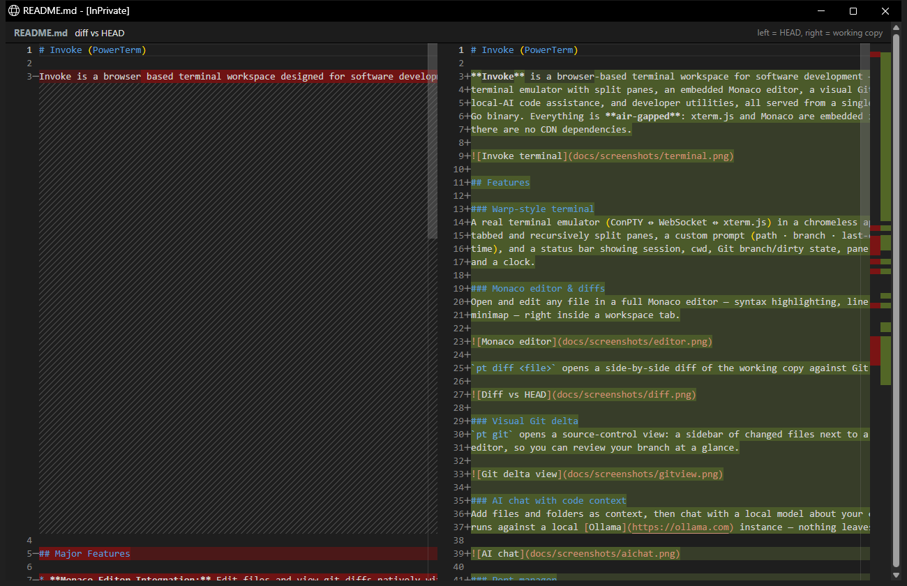
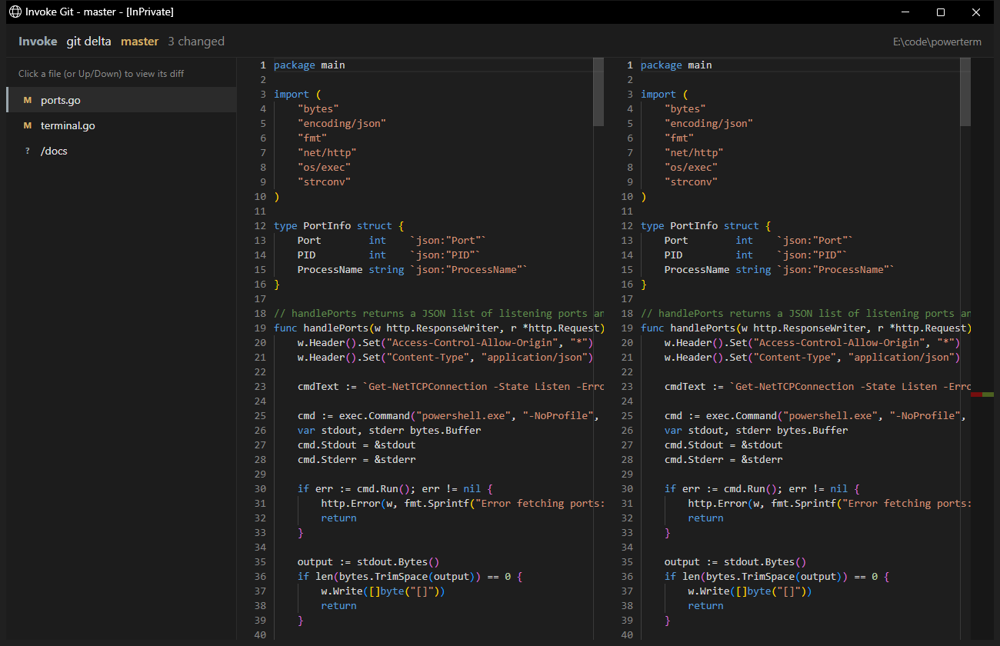
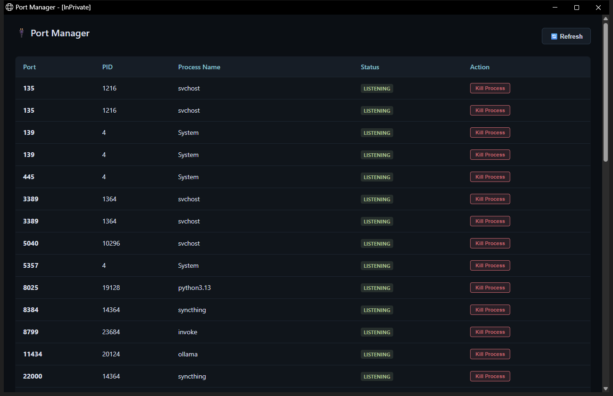

# Invoke

Air-gapped powershell terminal for windows, with file editor and tools.



---

## Subcommands & Features

### Editor & Diffs
* `pt edit <file>` : Open file in Monaco editor
* `pt diff <file>` : Side-by-side diff vs Git `HEAD`




### Source Control
* `pt git` : Visual Git status and side-by-side branch review



### Port Utility
* `pt ports` : List listening ports and kill associated processes



---


### Key Bindings
* `Ctrl + \` : Toggle file sidebar
* `Ctrl + Shift + P` : Command search palette
* `Ctrl + Shift + K` : Workspace scratchpad pane
* `Ctrl + Shift + T / W` : Open / Close tab
* `Ctrl + Shift + D / S` : Split / Stack panes

### Build & Run
```powershell
# 1. Build server
go build -ldflags "-H windowsgui" -o invoke-server.exe .

# 2. Build app launcher
go build -ldflags "-H windowsgui" -o invoke-app.exe .\cmd\invoke-app\

# 3. Run
.\invoke-app.exe
```
